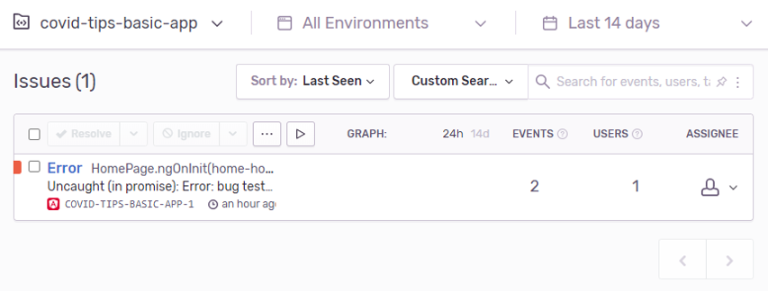

# Error Handling

## Local Development

When developing locally errors are handled by the default angular error handler, and are simply shown in the console with stack trace messages.

## Production

In production errors are automatically logged with [Sentry](https://sentry.io/) to allow better remote diagnosis.

_Sentry Error Tracking_

To view the dashboard request an invite from the project administrators. The code for the error handler can be customised in `ErrorHandler.ts`.

For more information about sentry, or features such as including additional data with logs or performance metrics see the [Sentry Docs](https://docs.sentry.io/)

## Releases and Sourcemaps

When errors are triggered from production they will show a stack trace relative to the build bundles, which may not identify very clearly exactly what event or source files triggered the error. Similarly, whilst standard device information will be recorded it may not be clear exactly what version of the app the user is using.

Therefore it is recommended to provide sentry with release and sourcemap information for new builds. Instructions to do so can be found within the [Sentry Docs](https://docs.sentry.io/), or some examples of how to automatically generate as part of build processes here:

https://docs.sentry.io/platforms/javascript/sourcemaps/

https://medium.com/angular-athens/make-angulars-source-code-available-to-sentry-with-gitlab-ci-b3020bd60ae6
